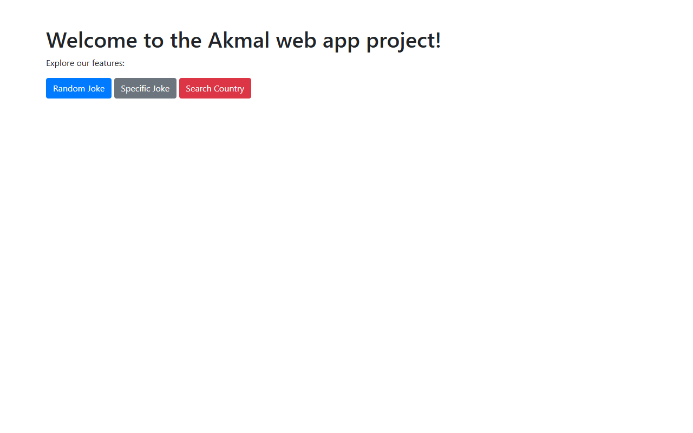
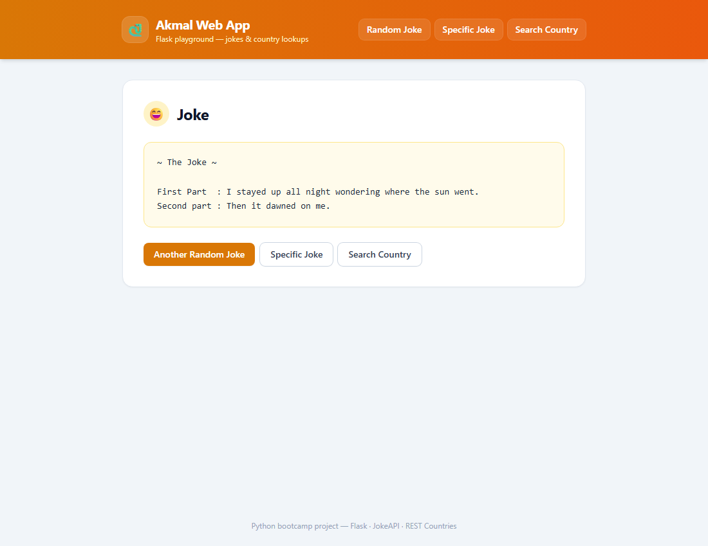
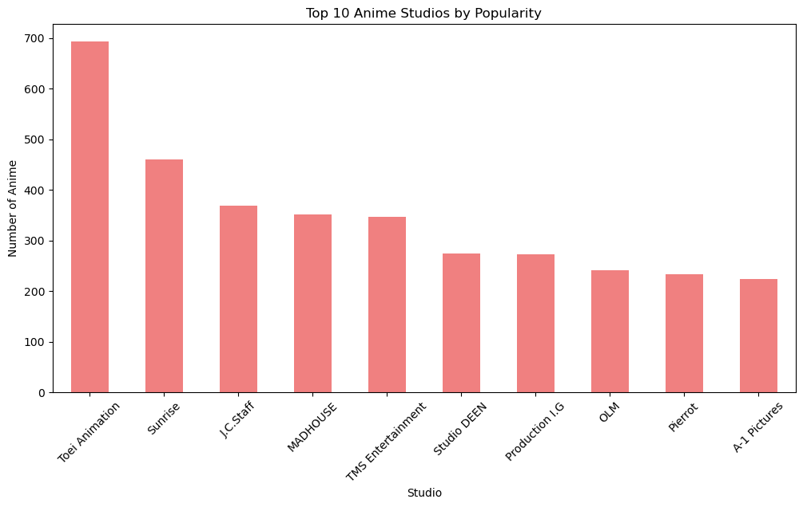

# Python Bootcamp Projects

Two beginner Python projects from the Exelerate Asia / K-Youth Python bootcamp (2023),
preserved as-is: a Flask web app that serves random/custom jokes (JokeAPI) and country
lookups (REST Countries), plus Jupyter notebooks — console prototypes of both API clients
and a Pandas/Matplotlib/Seaborn analysis of a Kaggle anime dataset.

This repo is the coursework behind the developer's **K-Youth Academy** bootcamp
certificate — K-Youth is a Khazanah Nasional talent-development programme, and this
Python track was delivered by Exelerate Asia in 2023. The code is kept as submitted.

> **New developer? Start with [`.docs/tldr.md`](.docs/tldr.md)** — every doc summarised on one
> page. The full guide lives in [`.docs/`](.docs/README.md).

## What's inside

| Project | Where | What it shows | Run status |
| --- | --- | --- | --- |
| Flask web app | `WebApp/script.py` | Routes, forms, Jinja2 templates, `requests` against external REST APIs (`JokeAPI` / `CountriesAPI` classes) | **Runs** — `just serve`, then browse `/` and `/random_joke` (JokeAPI v2 is alive). `/country` always errors: REST Countries v3.1 was deprecated upstream |
| Data analysis notebook | `Data Analyst/Data Analyst.ipynb` | Pandas + Matplotlib/Seaborn/WordCloud over the [Kaggle anime dataset (2022)](https://www.kaggle.com/datasets/vishalmane10/anime-dataset-2022/) | **Data-bound** — reads a hardcoded, uncommitted `anime.csv`, so `just execute` fails; download the dataset and run it in `just lab`. Committed cell outputs still show the charts (below) |
| Joke console prototype | `WebApp/Joke API - Web App.ipynb` | The joke client as an `input()`-driven console menu | **Interactive-only** — a headless kernel has no stdin; run it cell by cell in `just lab` |
| Country console prototype | `WebApp/Country API.ipynb` | The country client with hardcoded searches | **Blocked upstream** — the deprecated REST Countries v3.1 API returns an error notice the notebook can't handle |

Full failure details (observed, not guessed) are in
[`.docs/06-troubleshooting/common-issues.md`](.docs/06-troubleshooting/common-issues.md).

## Screenshots

The Flask app served locally with `just serve` (`http://127.0.0.1:8124`):

| Home (`/`) | Random joke (`/random_joke`) |
| --- | --- |
|  |  |

And two of the eleven visualisations from the committed outputs of
`Data Analyst/Data Analyst.ipynb` (the notebook's own saved cell outputs — the source CSV
itself is not committed):




*Charts rendered by `Data Analyst/Data Analyst.ipynb` over the Kaggle anime dataset (2022).*

## Prerequisites

| Tool | Version | Installed by |
| --- | --- | --- |
| PowerShell + winget | Windows 10/11 stock | — (the only true prerequisites) |
| Git | any recent | `setup.ps1` |
| Node.js | LTS (needed by the Claude CLI) | `setup.ps1` |
| uv (+ Python) | latest | `setup.ps1` |
| GitHub CLI | any recent | `setup.ps1` |
| just | any recent | `setup.ps1` |
| Claude Code CLI | latest | `setup.ps1` (optional, for AI-assisted dev) |

There is no `requirements.txt` — every recipe pulls its own dependencies through
`uv run --with ...` (downloaded once, cached after).

## Quick start

```powershell
# 1. One-time machine setup (idempotent — safe to re-run)
pwsh ./setup.ps1

# 2. Close and reopen PowerShell so PATH updates land

# 3. Open Jupyter Lab for the notebooks
just lab

# — or serve the Flask web app instead (same port, one at a time)
just serve
```

The app is now at **http://127.0.0.1:8124**. Stop it with `just stop`.

## Commands

Run `just` with no arguments to list every recipe. The ones you'll use daily:

| Command | What it does |
| --- | --- |
| `just lab` | Open Jupyter Lab on `http://127.0.0.1:8124` (foreground, Ctrl+C to stop) |
| `just execute <nb>` | Run one notebook headlessly via nbconvert (executed copy goes to `%TEMP%`) |
| `just serve` | Serve the Flask web app (`WebApp/script.py`) on `http://127.0.0.1:8124` |
| `just test` | Run the pytest suite (`tests/`) — offline, no server or port needed |
| `just stop` | Kill only this repo's python processes (Jupyter or Flask) |
| `just claudex` | Launch Claude Code (Sonnet, all permissions) |

## Testing

```powershell
just test
# equivalent: uv run --with flask,requests,pytest pytest tests -q
```

`tests/test_app.py` exercises the Flask app through Flask's `test_client` — no server, no
port, and **no internet**: every external HTTP call (JokeAPI, REST Countries) is
monkeypatched, so the suite is deterministic and safe to run while `just serve` is up.
Covered: `/` welcome page, `/random_joke` (single + two-part + upstream-failure shapes),
`/specific_joke` (form + POST with URL-building assertions), `/country` (form + invalid
search type), and the pure `CountriesAPI` URL builders.

One test deserves a callout: `test_country_search_fails_against_deprecated_api` pins the
**current broken behavior** of `/country` — REST Countries v3.1 is deprecated upstream, so
the test simulates the observed deprecation response and asserts the app renders its error
page. It is an honest regression lock, not a fake pass; if `/country` is ever migrated to
the current REST Countries API, that test should fail and be replaced with a real
success-path test.

## Troubleshooting

### `just execute` fails on every committed notebook

Expected — each notebook has a real blocker for headless runs: the Joke notebook drives an
`input()` menu (interactive-only), `Data Analyst.ipynb` reads a hardcoded
`C:\Users\Admin\Downloads\anime.csv` that is not committed (and has a planning cell with raw
markdown in a code cell, a `SyntaxError`), and the Country notebook calls the deprecated
REST Countries v3.1 API. Open them in `just lab` and run cells interactively instead.

### `/country` search always shows the error page

REST Countries retired the v3.1 endpoints the app was built against — they now return a
"this API version has been deprecated" notice, which `CountriesAPI.createCountry` reports as
a fetch error. The joke pages still work (JokeAPI v2 is alive). Fixing it means migrating
`WebApp/script.py` to the current REST Countries API.

### First `just lab` / `just execute` takes minutes

uv is downloading Jupyter (and pandas/matplotlib/seaborn/wordcloud for `execute`) into its
cache on first use. Later runs reuse the cache and start in seconds.

### Port 8124 already in use

`just lab` and `just serve` share port 8124 — run one at a time. `just stop` kills whichever
of the two this repo has running (it never touches other projects' servers).

More in [`.docs/06-troubleshooting/common-issues.md`](.docs/06-troubleshooting/common-issues.md).

## Project layout

```
python-bootcamp-projects/
  Data Analyst/
    Data Analyst.ipynb         # Pandas analysis of a Kaggle anime dataset (CSV not committed)
  WebApp/
    script.py                  # Flask app — joke + country lookup routes
    templates/                 # 6 Jinja2 templates (home, joke, country, forms, error)
    Joke API - Web App.ipynb   # console prototype of the joke client (input()-driven)
    Country API.ipynb          # console prototype of the country client
  tests/
    test_app.py                # pytest suite for the Flask app (offline, HTTP monkeypatched)
  docs/
    images/                    # README screenshots + charts extracted from notebook outputs
  .docs/                       # numbered documentation set
  .claude/                     # skills, hooks, settings
  justfile, setup.ps1
```
